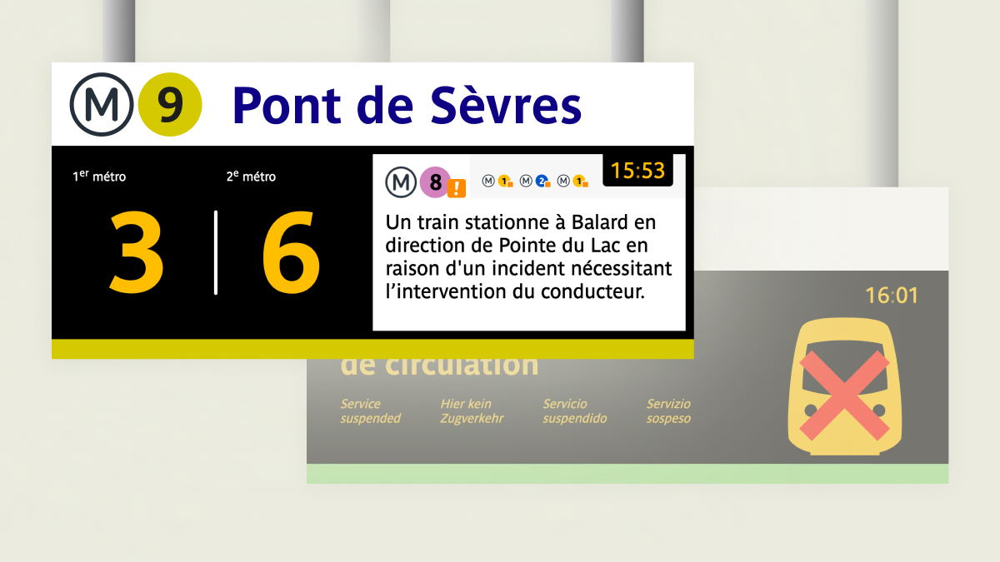

# PANAM



- Affichage des temps d'attente avec gros chiffres ou en colonnes s'il existe plusieurs destinations
- Info trafic en temps réel des lignes en correspondance
- Affichages spécifiques en cas d'absence de temps réel ou d'interruption de service

Le but de ce projet est de fournir un écran unique qui puisse s'adapter en fonction de la taille de l'écran et de la ligne en cours pour respecter le style des écrans dans les gares et stations RATP.

## Lancer en local 

```sh
npm run dev
```

> La version locale utilise une API elle aussi locale. Sachant que le code source de celle-ci n'est pour l'heure pas disponible, il suffit d'utiliser l'API de production avec la même clé d'API que celle utilisée pour la version locale.

## Contribuer

Vous pouvez fork le projet pour proposer des pull requests.

Pour les PR, merci de :
- __Joindre des images__ réelles si les modifications concernent l'interface.
- Indiquer les modifications effectuées et dans quel but. 
- Ne pas inclure de fonctionnlités non existantes en vrai.